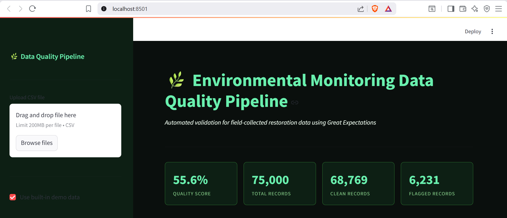
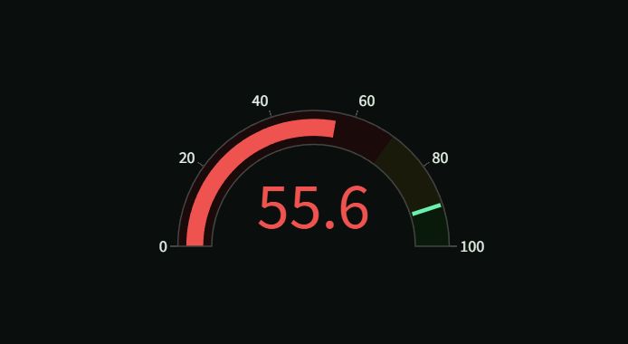
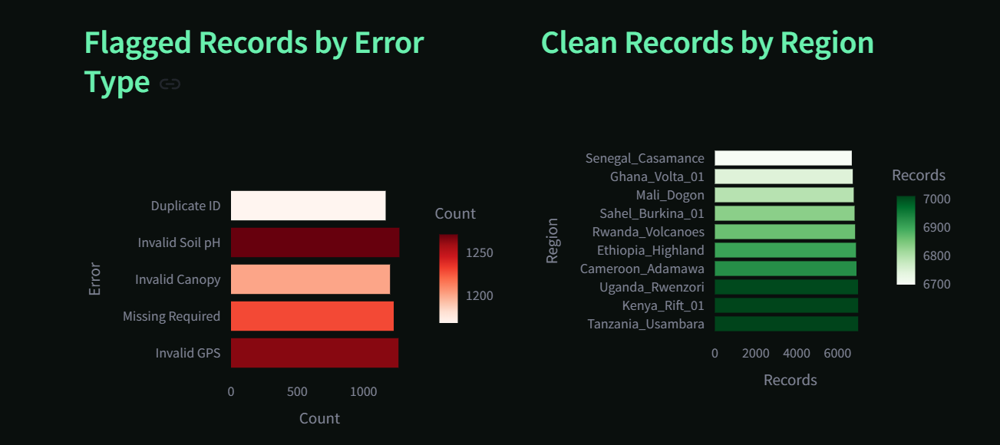
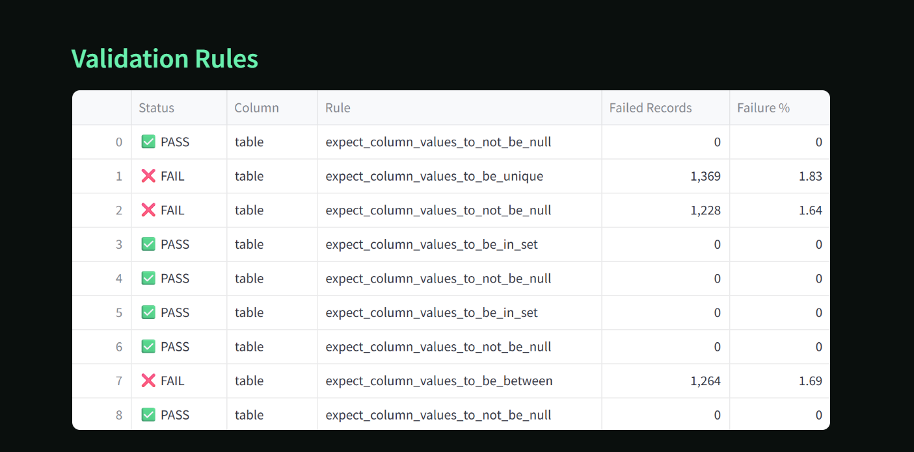

# Environmental Monitoring Data Quality Pipeline

An automated data validation framework for environmental field records collected by restoration programs across Africa. Built with Python, Great Expectations, PostgreSQL, and Streamlit.

> Amisha Ganvir - MPS Data Science, UMBC  
> github.com/HEX027

---



---

## The Problem

Restoration programs like WRI TerraFund collect field data from hundreds of local champions across Africa. That data arrives with missing values, invalid GPS coordinates, out-of-range measurements, and duplicate record IDs. Without a systematic validation layer, bad data silently corrupts downstream analysis and erodes funder confidence.

This pipeline catches those problems before they reach the database.

---

## What It Does

- Runs 25+ validation rules using Great Expectations on any uploaded CSV
- Returns an overall data quality score as a gauge chart
- Shows pass/fail for every rule with exact failure counts
- Displays every flagged record with the specific rule it failed
- Provides remediation recommendations for each error type
- Loads clean records into PostgreSQL with window function analytics
- Exports clean and flagged records as separate downloadable CSVs

---

## Dashboard



The gauge shows the overall quality score. Every validation rule shows pass or fail with exact failure counts.



Left chart shows flagged records by error type. Right chart shows clean records distributed across all 10 restoration regions.



Every flagged record shown with record ID, region, survey type, and the values that caused the failure.

---

## Architecture

```
Input
      |
      +-- Upload CSV via Streamlit UI
      +-- OR use built-in 75,000-record demo dataset
      |
      v
Validation Engine  src/validate.py
      |
      +-- Great Expectations ephemeral context
      +-- 25+ rules across 8 categories
      +-- Returns quality score, rule results, clean df, flagged df
      |
      v
Results Layer
      |
      +-- Streamlit dashboard   quality scorecard, charts, flagged table
      +-- JSON report           timestamped validation report in data/reports/
      +-- processed_clean.csv   records that passed all rules
      +-- flagged_records.csv   records that failed
      |
      v
Database Layer  src/load_db.py
      |
      +-- PostgreSQL 16         clean records loaded via SQLAlchemy
      +-- ON CONFLICT DO NOTHING  idempotent loads, safe to rerun
      +-- RANK() OVER            regions ranked by average canopy cover
```

---

## Validation Rules

| Category | Column | Rule |
|----------|--------|------|
| Required fields | record_id | Not null |
| Required fields | region | Not null |
| Required fields | survey_type | Not null |
| Required fields | latitude | Not null |
| Required fields | longitude | Not null |
| Required fields | survey_date | Not null |
| Required fields | surveyor_id | Not null |
| GPS bounds | latitude | Between -35 and 37 (Africa) |
| GPS bounds | longitude | Between -18 and 52 (Africa) |
| Measurement ranges | canopy_cover_pct | Between 0 and 100 |
| Measurement ranges | tree_height_m | Between 0 and 100 |
| Measurement ranges | soil_ph | Between 0 and 14 |
| Measurement ranges | biomass_kg | Between 0 and 100,000 |
| Duplicates | record_id | Must be unique |
| Valid categories | survey_type | One of 4 approved types |
| Valid categories | region | One of 10 approved regions |
| Date format | survey_date | Must match YYYY-MM-DD |
| Column types | latitude | Must be float |
| Column types | longitude | Must be float |
| Row count | table | At least 1 record |

---

## Error Types in Demo Dataset

The built-in demo dataset contains 75,000 records with 10% intentional errors:

| Error Type | Description |
|------------|-------------|
| invalid_gps | Latitude or longitude outside Africa bounds |
| missing_required | Null region or surveyor_id |
| invalid_range | Canopy cover above 100% or height below 0 |
| duplicate_record | Same record_id used more than once |
| future_date | Survey date set to year 2099 |
| invalid_ph | Soil pH above 14 |

---

## Database Schema

```sql
CREATE TABLE field_records (
    id               SERIAL PRIMARY KEY,
    record_id        VARCHAR(20) UNIQUE NOT NULL,
    region           VARCHAR(100),
    survey_type      VARCHAR(50),
    species          VARCHAR(100),
    latitude         NUMERIC(10,6),
    longitude        NUMERIC(10,6),
    tree_height_m    NUMERIC(6,2),
    canopy_cover_pct NUMERIC(5,1),
    soil_ph          NUMERIC(4,2),
    biomass_kg       NUMERIC(10,1),
    survey_date      DATE,
    surveyor_id      VARCHAR(20),
    loaded_at        TIMESTAMP DEFAULT NOW()
);

-- Indexes for fast filtering
CREATE INDEX idx_region      ON field_records(region);
CREATE INDEX idx_survey_date ON field_records(survey_date);
CREATE INDEX idx_survey_type ON field_records(survey_type);

-- Window function query after loading
SELECT region,
       COUNT(*) as total_records,
       ROUND(AVG(canopy_cover_pct)::numeric, 1) as avg_canopy,
       RANK() OVER (ORDER BY AVG(canopy_cover_pct) DESC) as canopy_rank
FROM field_records
GROUP BY region
ORDER BY canopy_rank;
```

---

## Stack

| Layer | Technology |
|-------|------------|
| Language | Python 3.11 |
| Validation | Great Expectations 0.18+ |
| Data processing | Pandas, NumPy |
| Database | PostgreSQL 16 |
| ORM | SQLAlchemy 2.0, psycopg2 |
| Dashboard | Streamlit |
| Charts | Plotly |

---

## Project Structure

```
env_quality_project/
+-- src/
|   +-- create_demo_data.py   generates 75,000 field records with realistic errors
|   +-- validate.py           Great Expectations engine, 25+ rules
|   +-- load_db.py            PostgreSQL loader with window function analytics
|   +-- dashboard.py          Streamlit app, upload CSV, instant quality scorecard
+-- data/
|   +-- raw/                  input CSV files
|   +-- reports/              timestamped JSON validation reports
+-- assets/
|   +-- screenshots
+-- requirements.txt
+-- .gitignore
+-- README.md
```

---

## Running Locally

```
git clone https://github.com/HEX027/env-monitoring-data-quality.git
cd env-monitoring-data-quality
pip install -r requirements.txt
python src/create_demo_data.py
python src/validate.py
python src/load_db.py
streamlit run src/dashboard.py
```

## About
https://github.com/HEX027
